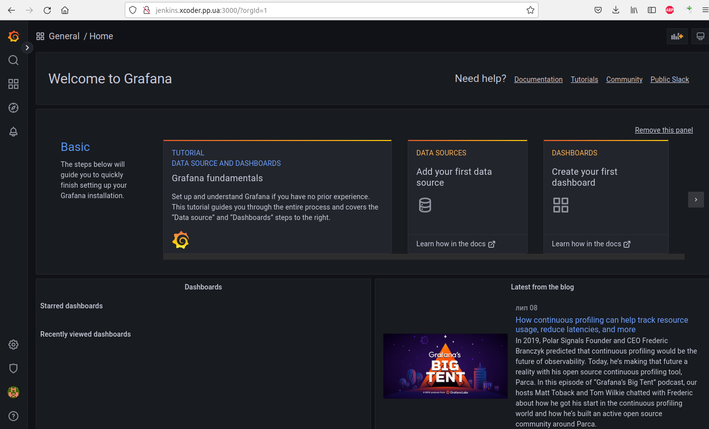
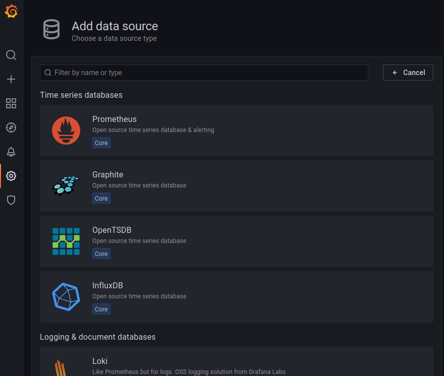
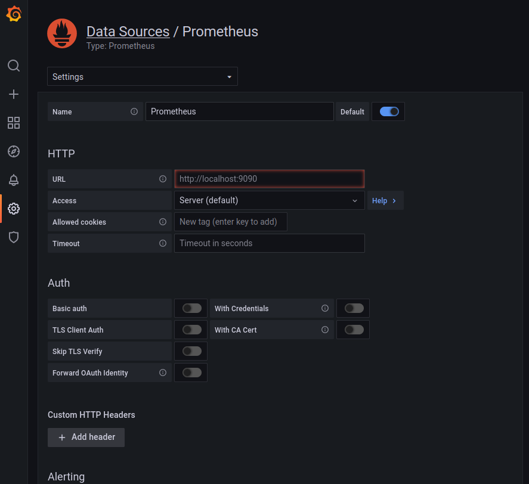
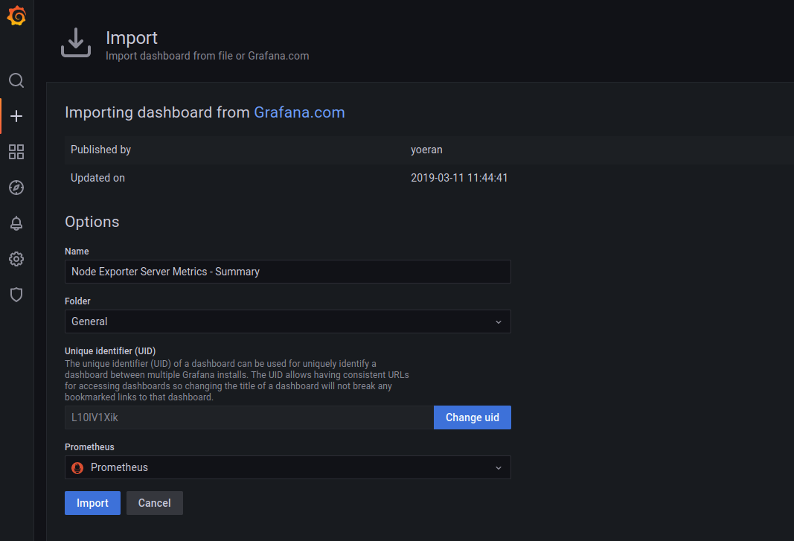
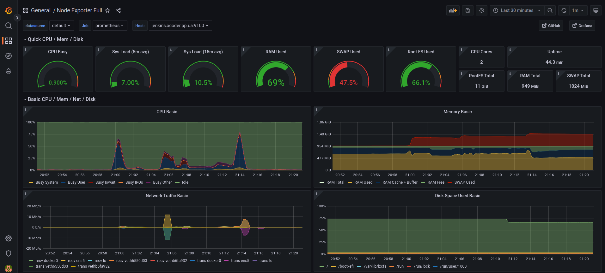
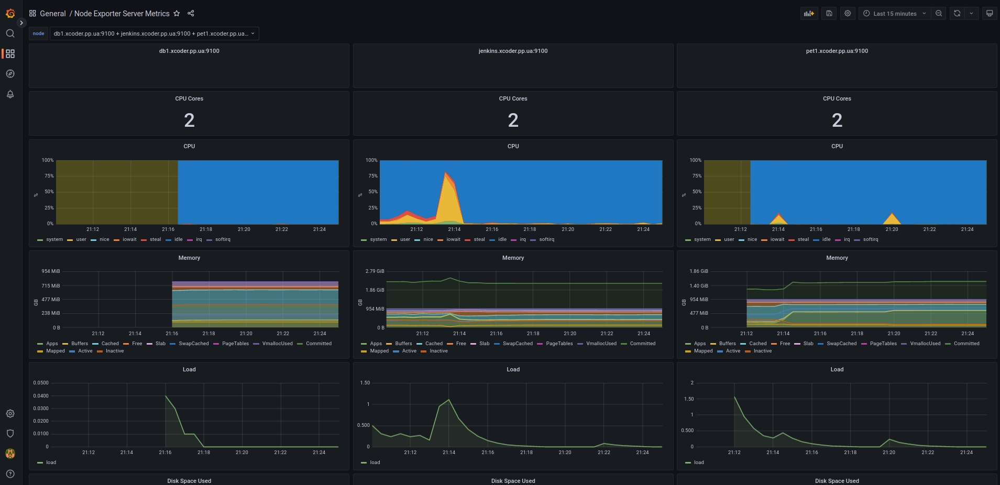
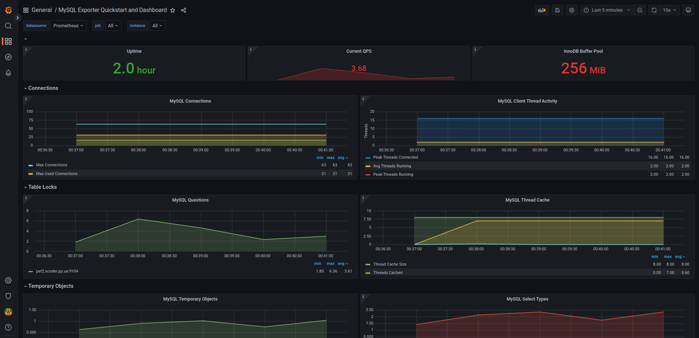

## 3. Grafana

Grafana is the last component of our solution. Its task is to connect to Prometheus and display the collected metrics on charts and dashboards. Grafana only interacts with Prometheus, since all collected metrics are stored there.

[install link 1](https://grafana.com/grafana/download?pg=oss-graf&plcmt=resources&edition=oss)

[install link 2](https://grafana.com/docs/grafana/latest/installation/debian/#install-from-apt-repository)

```
$ sudo apt-get install -y apt-transport-https
$ sudo apt-get install -y software-properties-common wget
$ wget -q -O - https://packages.grafana.com/gpg.key | sudo apt-key add -
$ echo "deb https://packages.grafana.com/oss/deb stable main" | sudo tee -a /etc/apt/sources.list.d/grafana.list
$ sudo apt-get update
$ sudo apt-get install grafana
```

Start the server with systemctl

To start the service and verify that the service has started:

```
$ sudo systemctl daemon-reload
$ sudo systemctl start grafana-server
$ sudo systemctl status grafana-server
```

Configure the Grafana server to start at boot:

```
$ sudo systemctl enable grafana-server.service
```

Once the installation is complete, open port 3000 on EC2 Instance Docker/Jenkins, navigate to "http://jenkins.xcoder.pp.ua:3000" in your browser. The default user and password is "admin"/"admin". The password will need to be changed upon first login.




### 3.1. Grafana configuration

[Configuration](https://grafana.com/docs/grafana/latest/administration/configuration/)

The first step is to set up a data source. In fact, this is the source of metrics for Grafana. We will be getting metrics from our Prometheus server, so choose Prometheus as the data source and specify the URL http://10.1.1.56:9090 (Configuration --> DataSources). The rest of the parameters are left as default.





In addition to Prometheus, Grafana can request and process data from many other systems.

### 3.2. Dashboard

After setting up the Datasource, we can create a dashboard. A dashboard is simply a set of panels located on the same page. Panels vary from plain text to pie charts. Each panel can be customized to display different metrics.

Creating your own dashboard from scratch can be a hard task. Luckily, Grafana provides an easy way to import dashboards created by other users. Once imported, the dashboard can be customized to suit your needs.

Import Dashboard



As an example, I will use dashboards located at the following links:

[Node Exporter Full](https://grafana.com/grafana/dashboards/1860)



[Node Exporter Resources Overview](https://grafana.com/grafana/dashboards/13702)


[Node Exporter Server Metrics](https://grafana.com/grafana/dashboards/405)



By looking at this page, you can get information about the state of the server, from how long it has been running to processor load and memory usage.

And for MySQL RDS Database 

[MySQL Exporter Quickstart and Dashboard](https://grafana.com/grafana/dashboards/14057)



