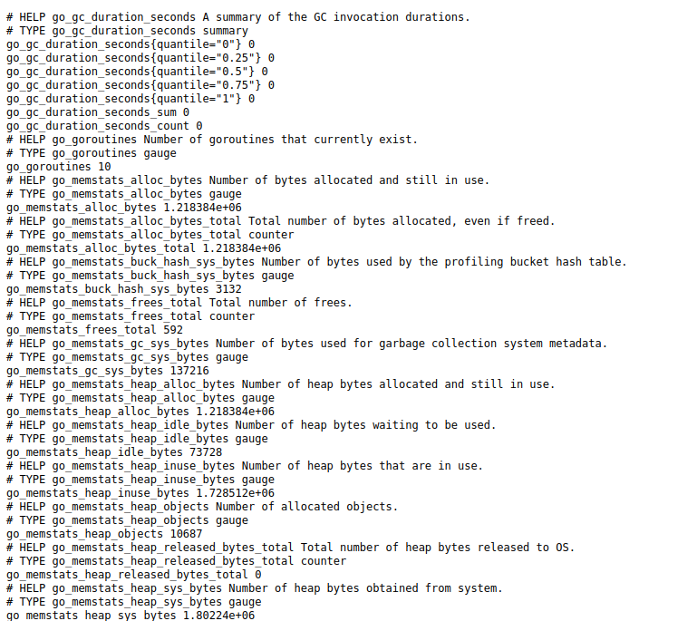
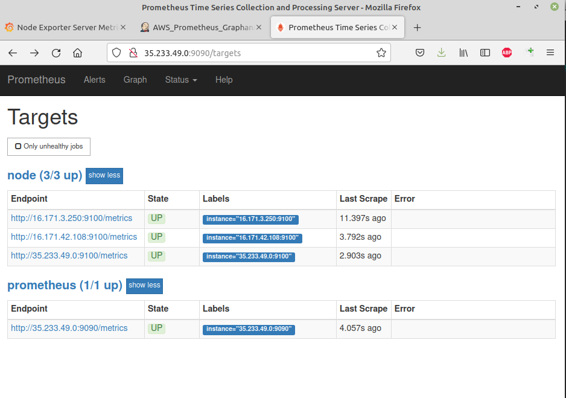
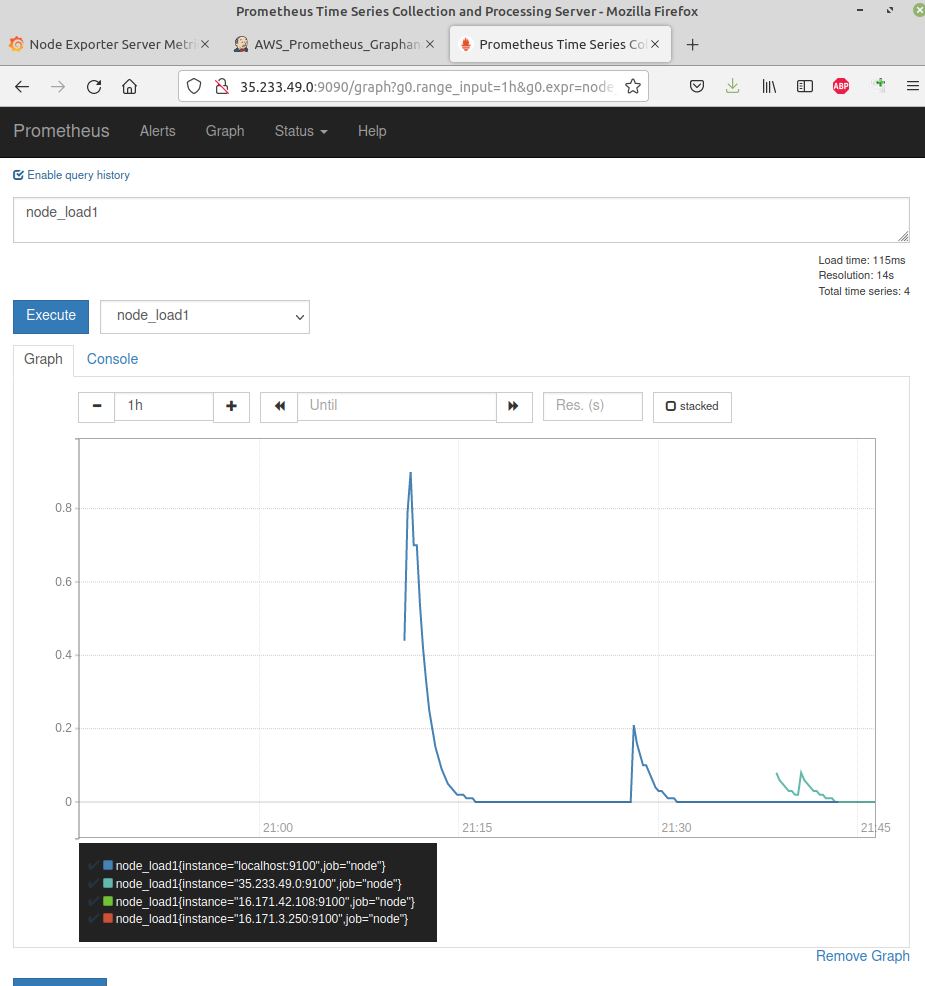
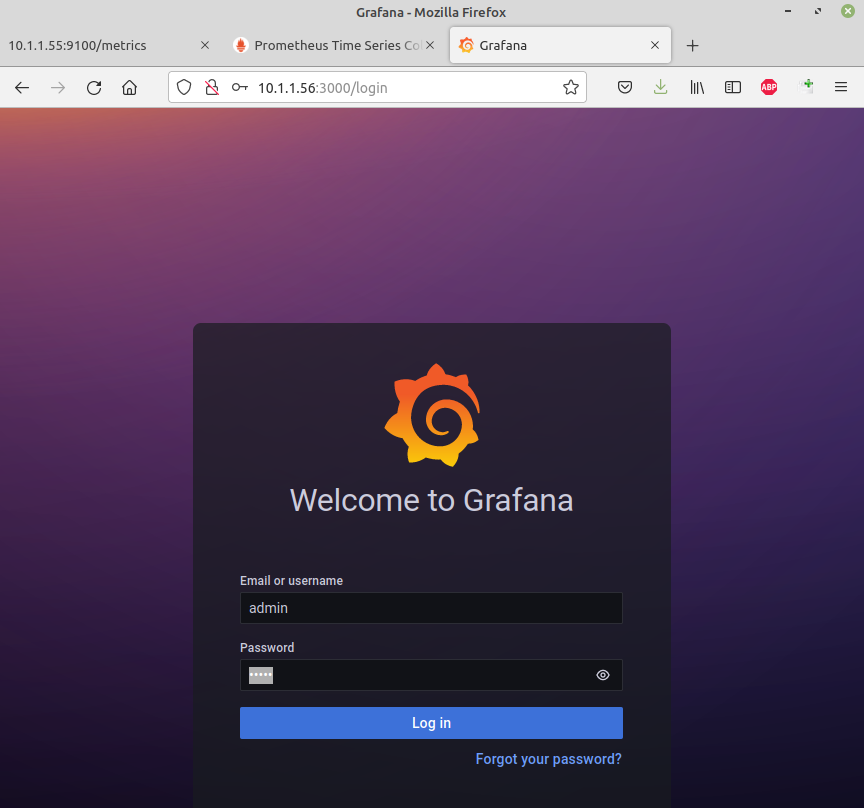
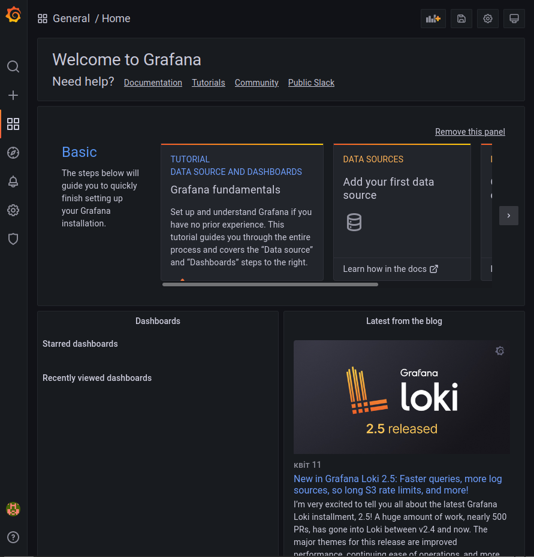
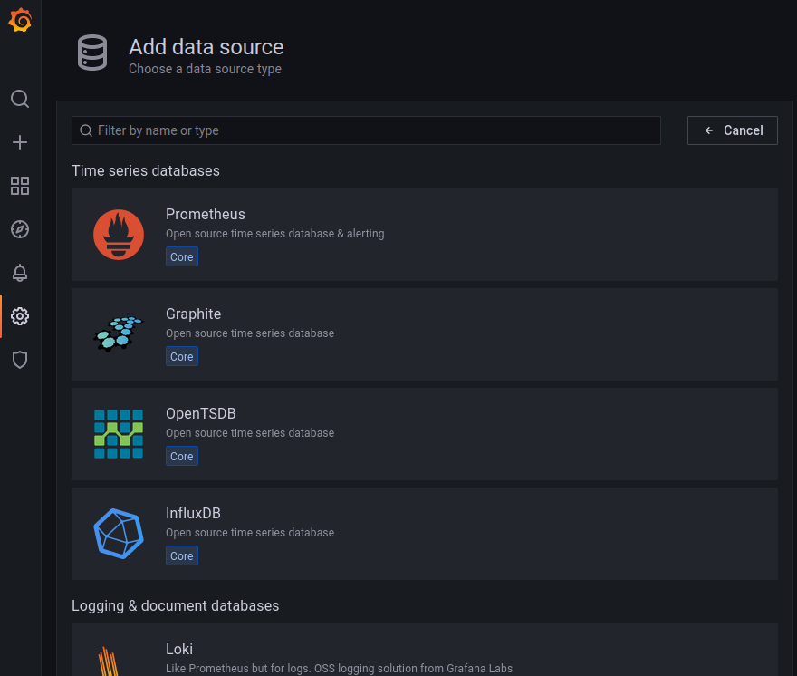
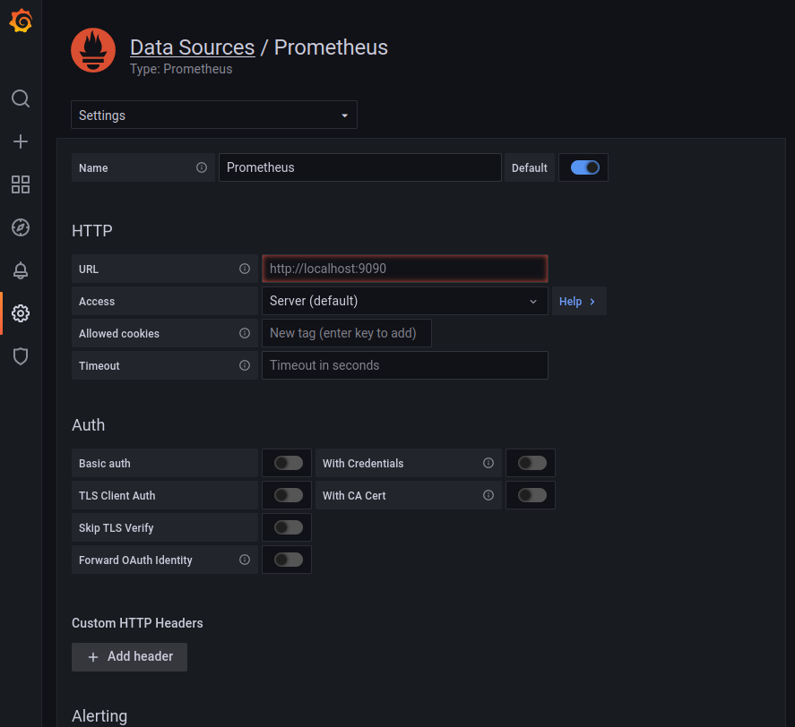
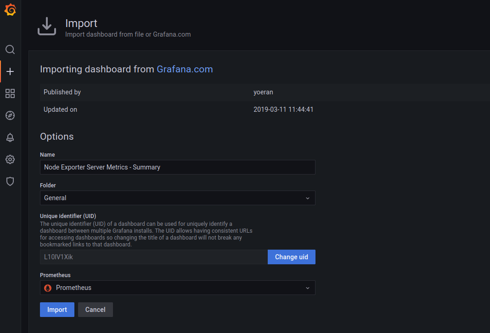
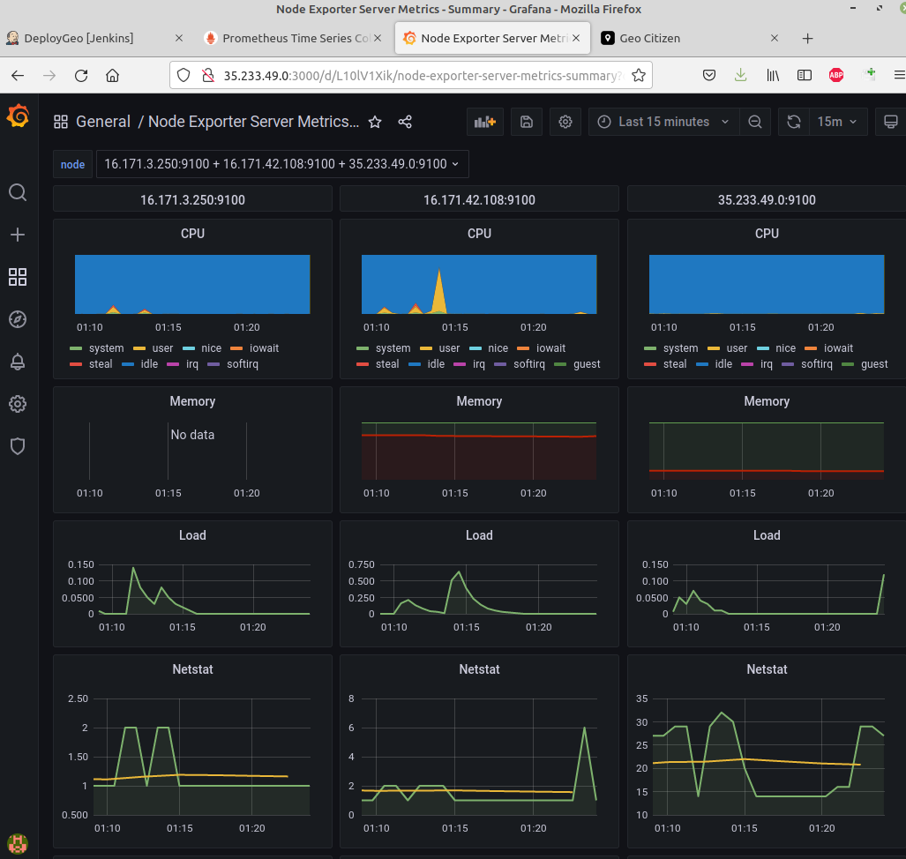

## Intro

More info [1](https://habr.com/ru/post/652185/) [2](https://eax.me/prometheus-and-grafana/)

Everyone needs monitoring: both the servers of large technology companies and home Raspberry PIs. Monitoring lets you know when a server is down, when disk space is running out, and even when it's time to upgrade.

**Prometheus** is an open source (Apache 2.0) time series DBMS (Database Management System)  written in Go and originally developed by SoundCloud. In other words, this thing stores your metrics. An interesting feature of Prometheus is that it pulls metrics from a given set of services (does a pull). Due to this, Prometheus cannot get any queues or something like that, which means that monitoring will never become a bottleneck in the system. The project is also interesting in that it fundamentally does not offer any horizontal scaling or high availability.

**Node Exporter** is a service whose task is to export information about a machine in a format understandable by Prometheus. In general, many ready-made exporters have been written for Prometheus for almost all existing systems - all sorts of web servers, DBMS, message queues, and so on. For the purposes of this note, we will only be using the Node Exporter, as you will need it anyway. Setting up other exporters is unlikely to be much different.

**Grafana** is an open source (Apache 2.0) web frontend to various time series database engines such as Graphite, InfluxDB, and of course Prometheus. All in all, Grafana draws beautiful graphs for you using information from Prometheus. Characteristically, Prometheus also has its own web interface. However, it is extremely minimalistic and rather inconvenient. Therefore, even the Prometheus developers themselves recommend using Grafana.

All steps described below were performed on Ubuntu Linux 18.04 LTS

## 1. Node Exporter

Install on needed nodes.

### 1.1. Ubuntu

`$ sudo apt-get install prometheus-node-exporter`

`$ prometheus-node-exporter --version`

Node Exporter is distributed as a single binary file that can be run from anywhere on the system. So the installation is pretty easy. After launch, go to the browser at the address 

`http://16.171.35.100:9100/metrics`

and look at the collected metrics in the web browser



### 1.2. CentOS 7

`$ wget https://github.com/prometheus/node_exporter/releases/download/v1.3.1/node_exporter-1.3.1.linux-amd64.tar.gz`

`$ tar -xzvf node_exporter-1.3.1.linux-amd64.tar.gz`

`$ sudo useradd -rs /bin/false nodeusr`

`$ sudo mv node_exporter-1.3.1.linux-amd64/node_exporter /usr/local/bin/`

`$ sudo nano /etc/systemd/system/node_exporter.service`

Add the following content to the file:

```
[Unit]
Description=Node Exporter
After=network.target

[Service]
User=nodeusr
Group=nodeusr
Type=simple
ExecStart=/usr/local/bin/node_exporter

[Install]
WantedBy=multi-user.target
```
`$ sudo systemctl daemon-reload`

`$ sudo systemctl enable node_exporter`
## 2. Prometheus

[Official repository](https://github.com/prometheus/prometheus)

The second step is to install Prometheus and configure it to collect data from the previously installed Node Exporter.

`$ sudo apt-get update`

`$ sudo apt-get install prometheus`

`$ prometheus --version`

To configure Prometheus to collect metrics from a previously installed Node Exporter instance, you need to modify the configuration file (/etc/prometheus/prometheus.yml). Let's add another URL to the static_configs section:

```
  - job_name: 'prometheus'

    # Override the global default and scrape targets from this job every 5 seconds.
    scrape_interval: 5s
    scrape_timeout: 5s

    # metrics_path defaults to '/metrics'
    # scheme defaults to 'http'.

    static_configs:
      - targets: ['35.233.49.0:9090']

  - job_name: node
    # If prometheus-node-exporter is installed, grab stats about the local
    # machine by default.
    static_configs:
      - targets: ['35.233.49.0:9100', '16.171.42.108:9100', '16.171.3.250:9100']

```

Here we have configured Prometheus to collect metrics from two services: itself ('35.233.49.0:9090') and the Node Exporter instances ('35.233.49.0:9100', '16.171.42.108:9100', '16.171.3.250:9100').

After launching Prometheus, you can open its user interface in the browser '35.233.49.0:9090'. The "/targets" page displays the status of the systems you are getting metrics from. If everything is good, then in the Status column (State) will be “UP”.



Already using only Prometheus, you can query the collected data and build graphs using the tools on the "/graph" page. It's a good tool for learning the metrics you're collecting and writing complex data queries. But we will entrust this work to Grafana.



## 3. Grafana

Grafana is the last component of our solution. Its task is to connect to Prometheus and display the collected metrics on charts and dashboards. Grafana only interacts with Prometheus, since all collected metrics are stored there.

[install link 1](https://grafana.com/grafana/download?pg=oss-graf&plcmt=resources&edition=oss)

[install link 2](https://grafana.com/docs/grafana/latest/installation/debian/#install-from-apt-repository)

```
$ sudo apt-get install -y apt-transport-https
$ sudo apt-get install -y software-properties-common wget
$ wget -q -O - https://packages.grafana.com/gpg.key | sudo apt-key add -
$ echo "deb https://packages.grafana.com/oss/deb stable main" | sudo tee -a /etc/apt/sources.list.d/grafana.list
$ sudo apt-get update
$ sudo apt-get install grafana
```

Start the server with systemctl

To start the service and verify that the service has started:

```
$ sudo systemctl daemon-reload
$ sudo systemctl start grafana-server
$ sudo systemctl status grafana-server
```

Configure the Grafana server to start at boot:

```
$ sudo systemctl enable grafana-server.service
```

Once the installation is complete, navigate to "http://10.1.1.56:3000" in your browser. The default user and password is "admin"/"admin". The password will need to be changed upon first login.






### 3.1. Grafana configuration

[Configuration](https://grafana.com/docs/grafana/latest/administration/configuration/)

The first step is to set up a data source. In fact, this is the source of metrics for Grafana. We will be getting metrics from our Prometheus server, so choose Prometheus as the data source and specify the URL http://10.1.1.56:9090 (Configuration --> DataSources). The rest of the parameters are left as default.





In addition to Prometheus, Grafana can request and process data from many other systems.

### 3.2. Dashboard

After setting up the Datasource, we can create a dashboard. A dashboard is simply a set of panels located on the same page. Panels vary from plain text to pie charts. Each panel can be customized to display different metrics.

Creating your own dashboard from scratch can be a hard task. Luckily, Grafana provides an easy way to import dashboards created by other users. Once imported, the dashboard can be customized to suit your needs.

As an example, I will use dashboard located at the following link:

[https://grafana.com/grafana/dashboards/9901](https://grafana.com/grafana/dashboards/9901)

+ --> Import





By looking at this page, you can get information about the state of the server, from how long it has been running to processor load and memory usage.

