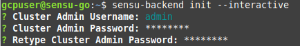
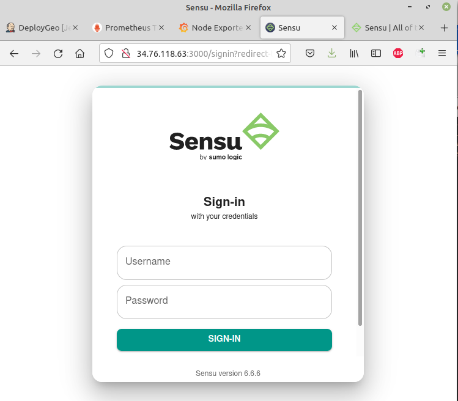
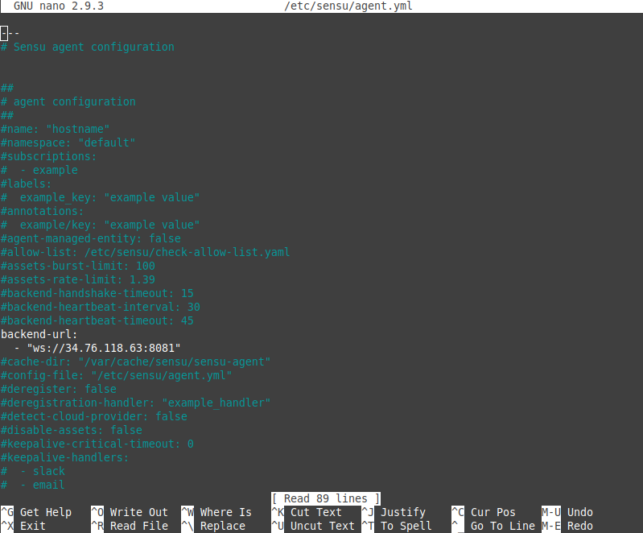
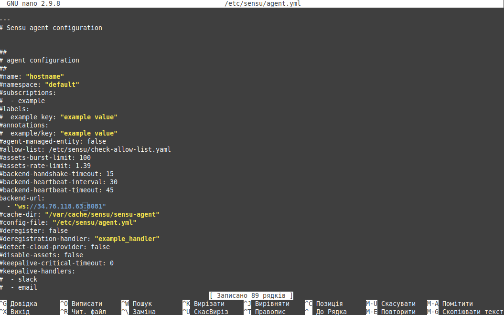
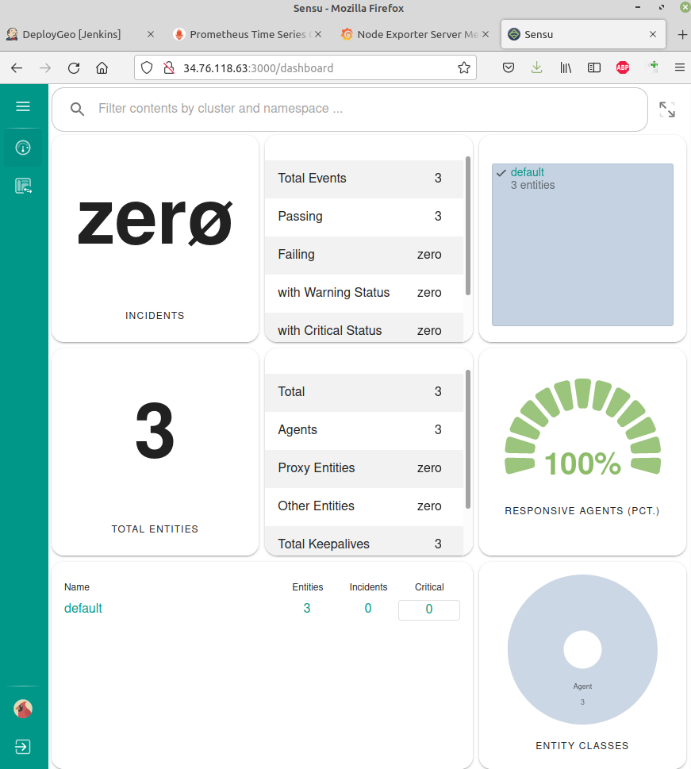
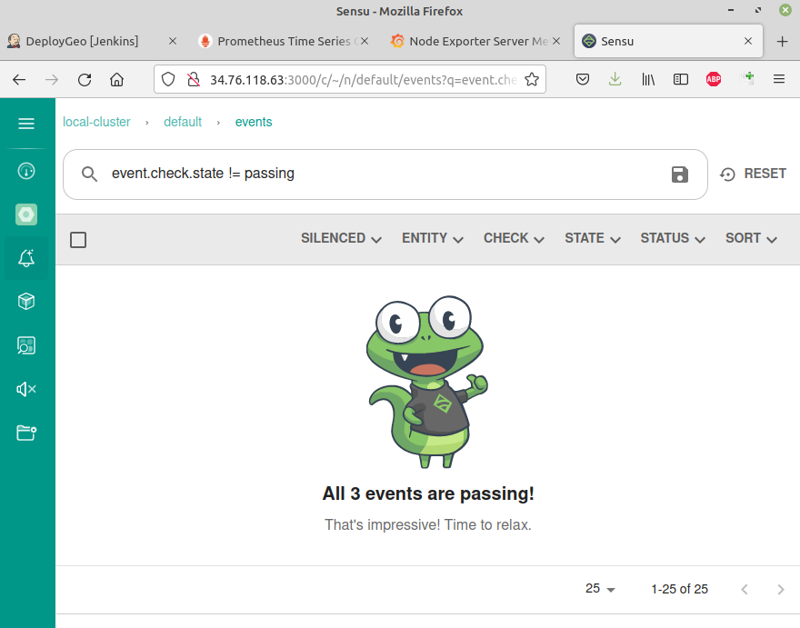
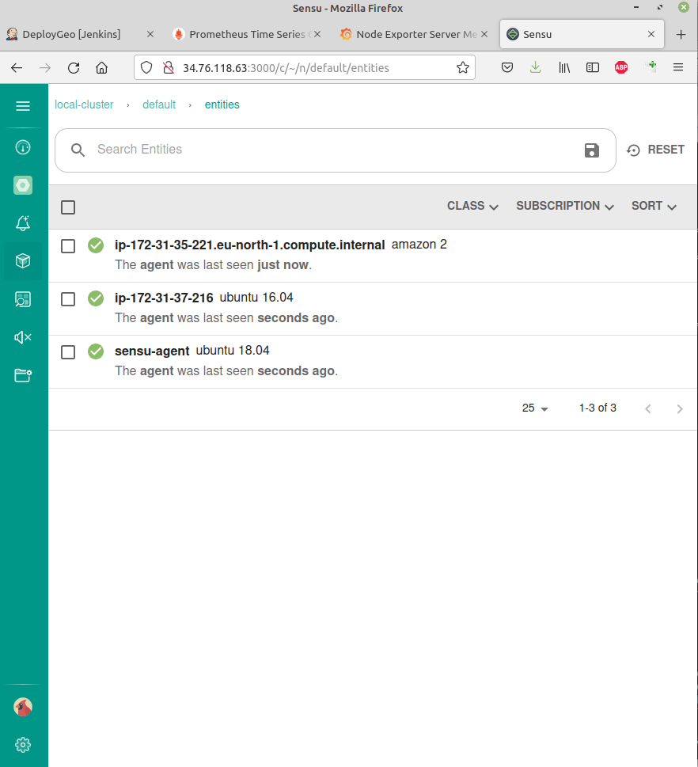
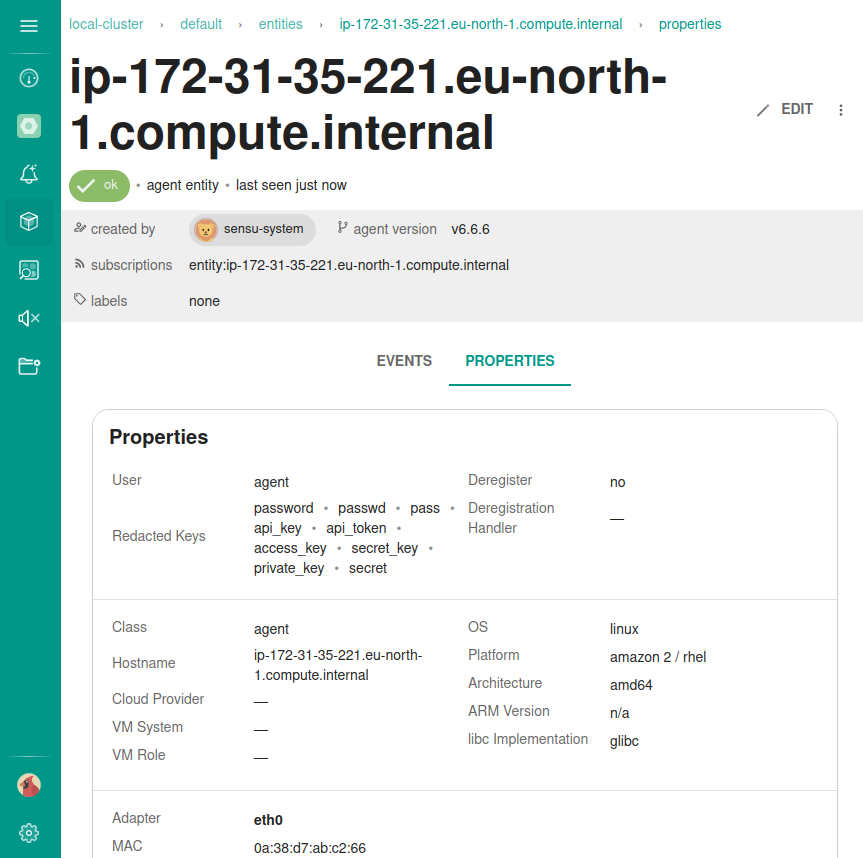

# Install Sensu GO

[Tutorial](https://linuxtutorialhub.com/how-to-install-sensu-go-on-ubuntu-18-04-20-04/)

[Official tutorial install info] (https://docs.sensu.io/sensu-go/latest/operations/deploy-sensu/install-sensu/)


## Install Sensu Go on Ubuntu 18.04


Sensu is an open-source, free and cross-platform monitoring software that is used to monitor different environments like public, private and hybrid cloud, and container-based environments. Sensu Go is the latest version of Sensu.

It is divided in three main primary components that are listed below:

 - **Sensu backend** – It is a service that manages check requests and observability data.

 - **Sensu Agent** – It is a lightweight client that runs on the infrastructure components you want to monitor.

 - **Sensuctl** – It is a command-line tool for managing resources within Sensu.

### 1. Install backend

Before install Sensu Go, you will need to update your system to the latest stable version and install some required packages and dependencies using commands below:

```
$ sudo apt update
$ sudo apt install curl gnupg unzip wg
```

To install Sensu backend, you will need to add its repository to Ubuntu by downloading the script and running it below:

```
$ curl -s https://packagecloud.io/install/repositories/sensu/stable/script.deb.sh | sudo bash
```

Now run the commands below to install Sensu backend:

```
$ sudo apt install sensu-go-backend
```

After installing Sensu backend, now download the configuration file in its default configure directory by running below command:

```
$ sudo curl -L https://docs.sensu.io./sensu-go/latest/files/backend.yml -o /etc/sensu/backend.yml
```

After installed, you can start and enable the Sensu backend service by running commands below:


```
$ sudo systemctl start sensu-backend
$ sudo systemctl enable sensu-backend
```
To check status of the Sensu backend , run the commands below:

```
$ sudo systemctl status sensu-backend
```

### 2. Access Sensu Dashboard

At this point, Sensu is installed in your ubuntu system, now create an admin to access Sensu web UI.

To create an admin, run the commands below :

`$ sensu-backend init --interactive`

Now, create an admin username and password as below:



`Cluster Admin API Key:` -- leave empty.

After create admin credentials, open your favorite web browser and browse the URL http://34.76.118.63:3000 as below:

`http://34.76.118.63:3000`

It will open the Sensu Web UI with sign in screen. Sign in with the admin credential that you are create above.




### 3. Install Sensu Go Agent (Ubuntu 18.04, 16.04)


You will need to install Sensu Go Agent to monitor your Sensu server by running command below:

```
$ sudo apt update
$ curl -s https://packagecloud.io/install/repositories/sensu/stable/script.deb.sh | sudo bash
$ sudo apt install sensu-go-agent
```

After installing, now download the Sensu Go Agent configuration file by running below command:

`$ sudo curl -L https://docs.sensu.io/sensu-go/latest/files/agent.yml -o /etc/sensu/agent.yml`

Edit /etc/sensu/agent.yml

`$ sudo nano /etc/sensu/agent.yml`

and add backend url to file



Now start the services of Sensu Go Agent server and go back to the backend UI :

`$ sudo service sensu-agent start`

### 4. Install Sensu Go Agent (CentOS)

Add the Sensu repository

`$ curl -s https://packagecloud.io/install/repositories/sensu/stable/script.rpm.sh | sudo bash`

Install the sensu-go-agent package

`$ sudo yum install sensu-go-agent`

Copy the config template from the docs

`$ sudo curl -L https://docs.sensu.io/sensu-go/latest/files/agent.yml -o /etc/sensu/agent.yml`

Edit /etc/sensu/agent.yml

`$ sudo nano /etc/sensu/agent.yml`

and add backend url to file



Start sensu-agent using a service manager

`$ sudo systemctl start sensu-agent`

### Use Web interface











