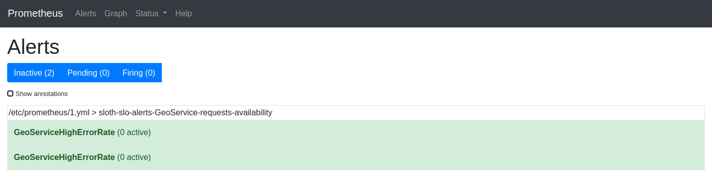
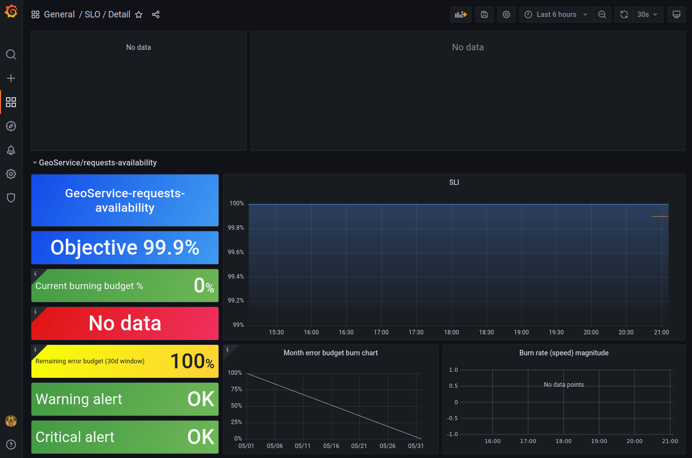

## slok/sloth

https://github.com/slok/sloth.git 

Get binary file from

https://github.com/slok/sloth/releases

## Generate rules file

`$ ./sloth generate -i geo_in.yml -o geo_out.yml`


```
geo_in.yml
------------------------
version: "prometheus/v1"
service: "GeoService"
labels:
  owner: "GeoTeam"
slos:
  # We allow failing (5xx and 429) 1 request every 1000 requests (99.9%).
  - name: "requests-availability"
    objective: 99.9
    description: "Common SLO based on availability for HTTP request responses."
    sli:
      events:
        error_query: sum(rate(http_request_duration_seconds_count{job="geocitizen",code=~"(5..|429)"}[{{.window}}]))
        total_query: sum(rate(http_request_duration_seconds_count{job="geocitizen"}[{{.window}}]))
    alerting:
      name: GeoServiceHighErrorRate
      labels:
        category: "availability"
      annotations:
        # Overwrite default Sloth SLO alert summmary on ticket and page alerts.
        summary: "High error rate on 'geoservice' requests responses"
      page_alert:
        labels:
          severity: Geopageteam
          routing_key: Geoteam

```

Copy geo_out.yml to /etc/prometheus

Modify /etc/prometheus/prometheus.yml

```
***********
rule_files:
  - "geo_out.yml"
***********
  - job_name: geocitizen
    static_configs:
      - targets: ['104.199.37.204:9100']
```

Restart Prometheus

## Grafana dashboard

https://grafana.com/grafana/dashboards/14348

## Results






