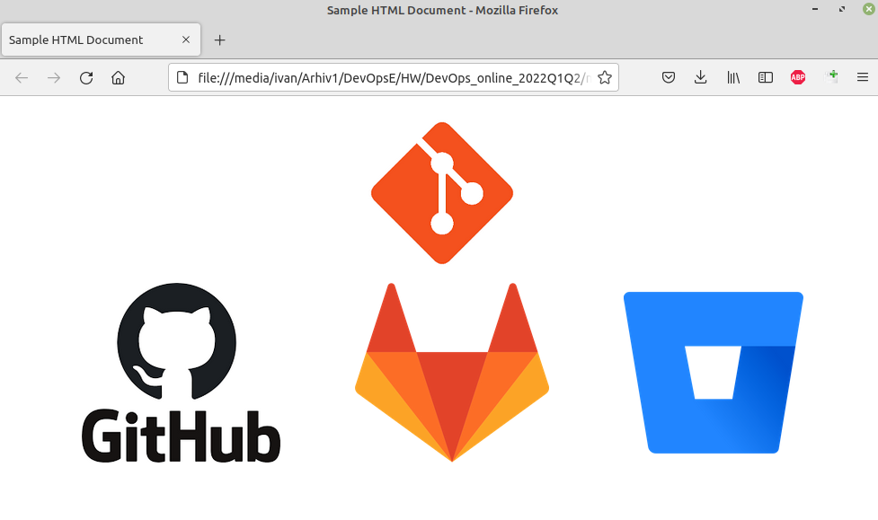

# 1. Results of my work with Git.

- Installed and configured git
- Created GitHub repository [DevOps_online_2022Q1Q2](https://github.com/uixcoder/DevOps_online_2022Q1Q2)
- Cloned repository to local PC
- In folder *task1.1* created sample html file with 4 images using git branching.

# 2. DevOps

Devops is a person who introduces processes, tools, and methodologies to balance needs throughout the software development life cycle, from coding and deployment, to maintenance and updates.