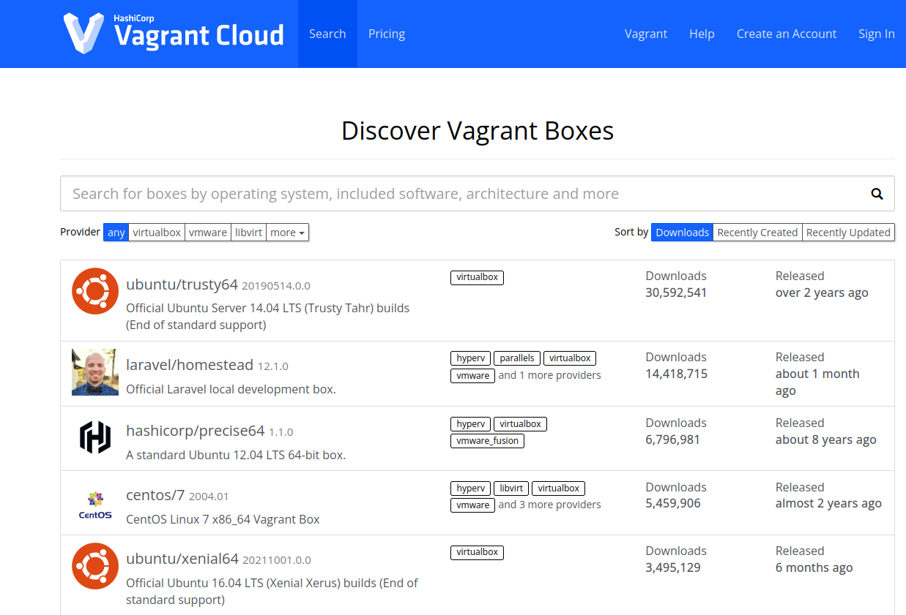
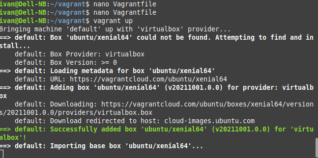
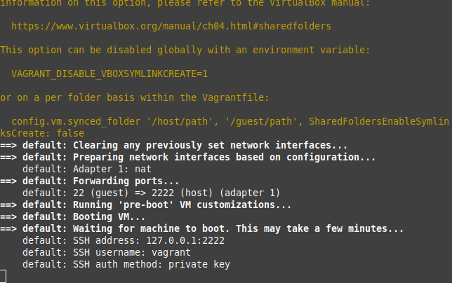
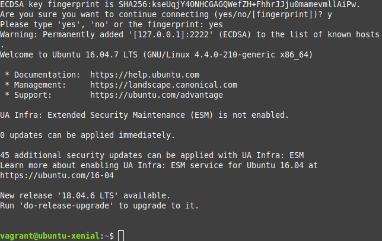
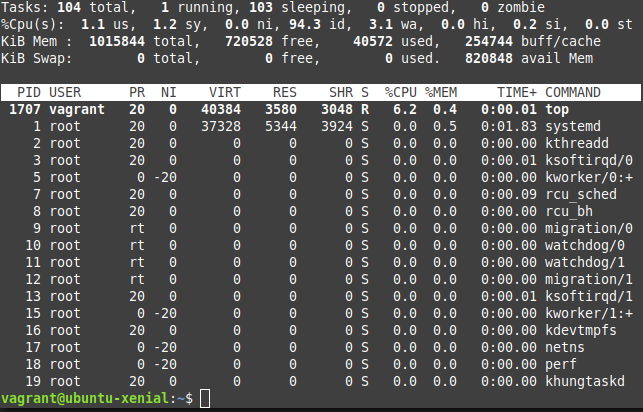
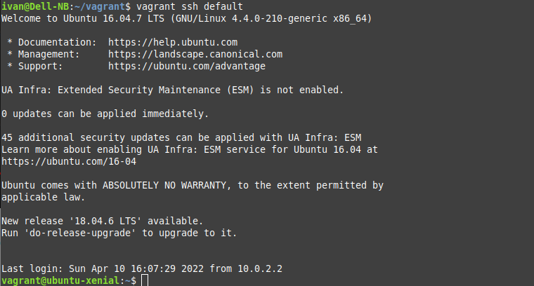

### 1. Install Vagrant

[Vagrant tutorial](https://www.youtube.com/watch?v=X03VYNZI2aY&list=PLnWmZqALnx9Bb9y8o_evmy6GgQsh2zq5R&index=6)

`$ sudo atp-get install vagrant`

### 2. Create and init folder for Vagrant

`$ vagrant init`

Creates Vagrantfile that describes configuration.

Images may be found at the official page

`https://app.vagrantup.com/boxes/search`

### 3.  Run config 

In default config it creates VM vith Virtualbox provider (at the default Virtualbox VM folder location). So, such configuration creates Vitrualbox VM with installed and configured Ubuntu 16.04 LTS.

Also it configures VM, creates default user vagrant,  generates and installs SSH key needed for creating SSH connection.

Creared VM may be accessed via SSH. Generated private key may be located at address

`.vagrant/machines/default/virtualbox/private_key`

So, the connection line to created VM looks like

`ssh vagrant@127.0.0.1 -p 2222 -i .vagrant/machines/default/virtualbox/private_key`

### 4. SSH

SSH connection may be simpler. View all available ssh connections to created virtual machines.

`$ vagrant ssh-config`

Hosts are also available via ssh in the much more shorter way

`$ vagrant ssh default`

### 5. Destroy VM

`$ vagrant destroy -f`

or

`$ vagrant destroy`

