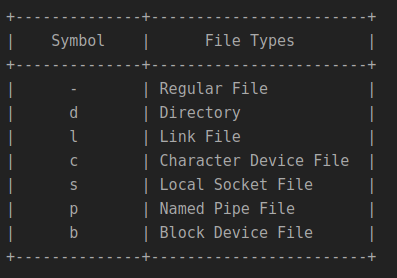

## Task1.
### Part1

#### 1) Log in to the system as root (or sudo-er).


default content of /etc/sudoers

```
#
# This file MUST be edited with the 'visudo' command as root.
#
# Please consider adding local content in /etc/sudoers.d/ instead of
# directly modifying this file.
#
# See the man page for details on how to write a sudoers file.
#
Defaults	env_reset
Defaults	mail_badpass
Defaults	secure_path="/usr/local/sbin:/usr/local/bin:/usr/sbin:/usr/bin:/sbin:/bin:/snap/bin"

# Host alias specification

# User alias specification

# Cmnd alias specification

# User privilege specification
root	ALL=(ALL:ALL) ALL

# Members of the admin group may gain root privileges
%admin ALL=(ALL) ALL

# Allow members of group sudo to execute any command
%sudo	ALL=(ALL:ALL) ALL

# See sudoers(5) for more information on "#include" directives:

#includedir /etc/sudoers.d

```

As may be seen from /etc/sudoers


default user (ivan in my case) belongs to groups adm and sudo.

If you have already created the user, you can add the user to the sudo group by running the following command in a Terminal:

`$ sudo usermod -a -G sudo newuser`

or edit the sudoers file directly and add:

`$ newuser    ALL=(ALL:ALL) ALL`

#### 2) Use the passwd command to change the password. Examine the basic parameters of the command. What system file does it change ?


It changes /etc/shadow file - file with password hashes.

#### 3) Determine the users registered in the system, as well as what commands they execute. What additional information can be gleaned from the command execution?

`$ awk -F: '{ print $1}' /etc/passwd`

Currently active users:

`$ w`

Every user’s command history is stored in /etc/username/.bash_history file. So if you want to view past commands executed by a user ivan just open terminal and run the following command to open that user’s .bash_history file.

`$ sudo cat /home/ivan/.bash_history`

The same is for root user

`$ sudo cat /root/.bash_history`

It is the same as logging into Linux as that user and running history command.

#### 4) Change personal information about yourself.

`$ chfn username`

#### 5) Become familiar with the Linux help system and the man and info commands. Get help on the previously discussed commands, define and describe any two keys for these commands. Give examples.

`$ man ls`

`$ man -a ls`

Display,  in  succession, all of the available ls manual pages contained within the manual.  It is possible to quit between successive displays or skip any of them.

`$ man -k printf`

Search the short descriptions and manual page names for the keyword printf as regular expression.  Print out any matches.   

#### 6) Explore the more and less commands using the help system. View the contents of files .bash* using commands.

`find . .bash* -printf "\nCONTENT OF FILE '%p':\n\n" -exec cat {} \;`

#### 7) * Determine the last logon time for all users. Tip: You should read the documentation for the finger command.

`$ finger -s`

`$ grep -v '/usr/sbin/nologin\|/bin/false\|/bin/sync' /etc/passwd | awk -F: '{ print $1}' | xargs finger -sm | tail -n+2 | grep -v 'No logins' `


#### 8) * List the contents of the home directory using the ls command, define its files and directories. Hint: Use the help system to familiarize yourself with the ls command.


##Task1.
###Part2
####1) Examine the tree command. Master the technique of applying a template, for example, display all files that contain a character c, or files that contain a specific sequence of characters. List subdirectories of the root directory up to and including the second nesting level.

```
NAME
       tree - list contents of directories in a tree-like format.

SYNOPSIS
       tree [-acdfghilnpqrstuvxACDFQNSUX] [-L level [-R]] [-H baseHREF] [-T title] [-o filename] [--nolinks] [-P pattern] [-I pattern] [--inodes]
       [--device] [--noreport] [--dirsfirst] [--version] [--help] [--filelimit #] [--si] [--prune] [--du] [--timefmt format]  [--matchdirs]  [--]
       [directory ...]


LISTING OPTIONS
       -L level
              Max display depth of the directory tree.

       -P pattern
              List  only  those  files that match the wild-card pattern.  Note: you must use the -a option to also consider those files beginning
              with a dot `.'  for matching.  Valid wildcard operators are `*' (any zero or more characters), `?' (any single character),  `[...]'
              (any  single  character  listed  between brackets (optional - (dash) for character range may be used: ex: [A-Z]), and `[^...]' (any
              single character not listed in brackets) and `|' separates alternate patterns.

       --ignore-case
              If a match pattern is specified by the -P or -I option, this will cause the pattern to match without regards to the  case  of  each
              letter.

       --prune
              Makes  tree  prune  empty directories from the output, useful when used in conjunction with -P or -I.  See BUGS AND NOTES below for
              more information on this option.

```


`$ tree -P '*c*' -L 2 --prune --ignore-case /home`


#### 2) What command can be used to determine the type of file (for example, text or binary)? Give an example.

`$ file .ssh'


#### 3) Master the skills of navigating the file system using relative and absolute paths. How can you go back to your home directory from anywhere in the filesystem?

An absolute path is a path that describes the location of a file or folder regardless of the current working directory; in fact, it is relative to the root directory. It contains the complete location of a file or directory, hence the name. 

Sample:

`\home\ivan\1.txt`

A relative path is a path that describes the location of a file or folder in relative to the current working directory.

Sample:

`..\1.txt`

`.` - current directory

`..` - parent directory

`~` current user home directory

`$ cd ~`


#### 4) Become familiar with the various options for the ls command. Give examples of listing directories using different keys. Explain the information displayed on the terminal using the -l and -a switches.

`-a, --all` - do not ignore entries starting with `.`


`-l` - use a long listing format


####5) Perform the following sequence of operations:
- create a subdirectory in the home directory;


- in this subdirectory create a file containing information about directories located in the root directory (using I/O redirection operations);
- view the created file;


- copy the created file to your home directory using relative and absolute addressing.


- delete the previously created subdirectory with the file requesting removal;


- delete the file copied to the home directory.


#### 6) Perform the following sequence of operations:
- create a subdirectory test in the home directory;


- copy the .bash_history file to this directory while changing its name to labwork2;


- create a hard and soft link to the labwork2 file in the test subdirectory;


- how to define soft and hard link, what do these concepts;

Hard link is an other name of file (creates new inode in filesystem that directs to the same data).

Soft link is a file that contains path to file

- change the data by opening a symbolic link. What changes will happen and why

I change file labwork2 by opening a symbolic link.

- rename the hard link file to hard_lnk_labwork2;
- rename the soft link file to symb_lnk_labwork2 file;


- then delete the labwork2. What changes have occurred and why?


As labwork2 file (only one of its name) is deleted - soft link is not working. But hard link is still fine and directs to data.

#### 7) Using the locate utility, find all files that contain the squid and traceroute sequence.


#### 8) Determine which partitions are mounted in the system, as well as the types of these partitions.

`mount | grep ^/dev/sd | awk '{printf("%s\t%s\t%s\n",$1,$5,$3)}'`


#### 9) Count the number of lines containing a given sequence of characters in a given file.


#### 10) Using the find command, find all files in the /etc directory containing the host character sequence.


`$ find /etc -type f -exec grep -l 'host' {} \;`

#### 11) List all objects in /etc that contain the ss character sequence. How can I duplicate a similar command using a bunch of grep?

`find /etc -type f -exec grep -l 'ss' {} \;`

#### 12) Organize a screen-by-screen print of the contents of the /etc directory. Hint: You must use stream redirection operations.

`$ ls -al /etc | more`

#### 13) What are the types of devices and how to determine the type of device? Give examples.


In the ls command you can see the type of file with the first bit on each line. Device files are denoted as the following:

    c - character
    b - block
    p - pipe
    s - socket

Character Device

These devices transfer data, but one a character at a time. You'll see a lot of pseudo devices (/dev/null) as character devices, these devices aren't really physically connected to the machine, but they allow the operating system greater functionality.

Block Device

These devices transfer data, but in large fixed-sized blocks. You'll most commonly see devices that utilize data blocks as block devices, such as harddrives, filesystems, etc.

Pipe Device

Named pipes allow two or more processes to communicate with each other, these are similar to character devices, but instead of having output sent to a device, it's sent to another process.

Socket Device

Socket devices facilitate communication between processes, similar to pipe devices but they can communicate with many processes at once.

#### 14) How to determine the type of file in the system, what types of files are there?

ls command will show the file type as an encoded symbol found as the first character of the file permission part. In this case it is “-“, which means “regular file”. It is important to point out that Linux file types are not to be mistaken with file extensions.



#### 15) * List the first 5 directory files that were recently accessed in the /etc directory.

`$ ls -1t / | head -5`


