#### 1) Analyze the structure of the /etc/passwd and /etc/group file, what fields are present in it, what users exist on the system? Specify several pseudo-users, how to define them?

The /etc/passwd contains one entry per line for each user (user account) of the system. All fields are separated by a colon (:) symbol. Total of seven fields as follows. Generally, /etc/passwd file entry looks as follows:

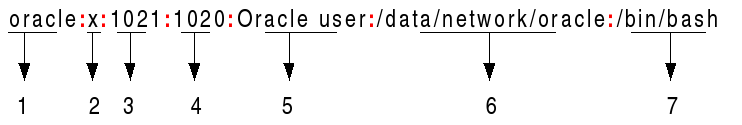

From the above image:

**1. Username:** It is used when user logs in. It should be between 1 and 32 characters in length.

**2. Password:** An x character indicates that encrypted password is stored in /etc/shadow file. Please note that you need to use the passwd command to computes the hash of a password typed at the CLI or to store/update the hash of the password in /etc/shadow file.

**3. User ID (UID):** Each user must be assigned a user ID (UID). UID 0 (zero) is reserved for root and UIDs 1-99 are reserved for other predefined accounts. Further UID 100-999 are reserved by system for administrative and system accounts/groups.

**4. Group ID (GID):** The primary group ID (stored in /etc/group file)

**5. User ID Info (GECOS):** The comment field. It allow you to add extra information about the users such as user’s full name, phone number etc. This field use by finger command.

**6. Home directory:** The absolute path to the directory the user will be in when they log in. If this directory does not exists then users directory becomes /

**7. Command/shell:** The absolute path of a command or shell (/bin/bash). Typically, this is a shell. Please note that it does not have to be a shell. For example, sysadmin can use the nologin shell, which acts as a replacement shell for the user accounts. If shell set to /sbin/nologin and the user tries to log in to the Linux system directly, the /sbin/nologin shell closes the connection.

/etc/group file stores group information or defines the user groups i.e. it defines the groups to which users belong. There is one entry per line, and each line has the following format (all fields are separated by a colon (:)

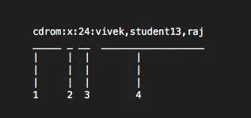

Where,

**1. group_name:** It is the name of group. If you run ls -l command, you will see this name printed in the group field.

**2. Password:** Generally password is not used, hence it is empty/blank. It can store encrypted password. This is useful to implement privileged groups.

**3. Group ID (GID):** Each user must be assigned a group ID. You can see this number in your /etc/passwd file.

**4. Group List:** It is a list of user names of users who are members of the group. The user names, must be separated by commas.

Pseudo-users. In the
password file. These descriptions are never edited. Users of these names are not registered in the system and are only needed to confirm ownership of the processes. The most used are:

**daemon** - Used by system service processes

**bin** - Gives ownership of executables command

**adm** - Owns registration files

**nobody** - Used by many services

**sshd** – used by the secure shell server.


#### 2) What are the uid ranges? What is UID? How to define it?

**UID (User Identifier)** is a number assigned by Linux to each user on the system. This number is used to identify the user to the system and to determine which system resources the user can access. UIDs are stored in the /etc/passwd file/

Typically, accounts with UIDs less than
10 belong to the system, and UIDs 10 to 100 are reserved for pseudo-users associated with special programs.

New users are assigned UIDs starting from 500 or 1000. For example, new users in Ubuntu start from 1000

The passwords of these pseudo-users in the /etc/shadow file are usually replaced with an asterisk, so that you cannot log in with a service name. To defend against remote login attacks (when SSH key files are used instead of passwords), specify /bin/false or /bin/nologin as shells (instead of /bin/bash or /bin/sh).

#### 3) What is GID? How to define it?

Groups in Linux are defined by **GIDs (group IDs)**. Just like with UIDs, the first 100 GIDs are usually reserved for system use. The GID of 0 corresponds to the root group and the GID of 100 usually represents the users group. GIDs are stored in the /etc/groups file.

New groups are usually assigned GIDs starting from 1000.

#### 4) How to determine belonging of user to the specific group?

#### 5) What are the commands for adding a user to the system? What are the basic parameters required to create a user?

`adduser`

`useradd`

#### 6) How do I change the name (account name) of an existing user?

`usermod [-l new username] username`

#### 7) What is skell_dir? What is its structure?

Directory /etc/skel/ (skel is derived from the “skeleton”) is used to initiate home directory when a user is first created. A sample layout of “skeleton” user files is as shown below:

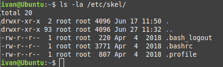

#### 8) How to remove a user from the system (including his mailbox)?

`$ sudo userdel -r test1`

#### 9) What commands and keys should be used to lock and unlock a user account?

#### Method-1: passwd command

Lock 

`$sudo passwd -l test1`

Status

`$sudo passwd -S test1`

Unlock

`$sudo passwd -u test1`

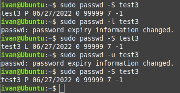


#### Method-2: usermod command

*Lock 

`$sudo usermod -L test1`

Status

`$sudo passwd -S test1`

Unlock

`$sudo usermod -U test1`**

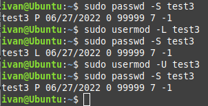

#### 10) How to remove a user's password and provide him with a password-free login for subsequent password change?

```
sudo passwd -d test1
sudo passwd -e test1
```
#### 11) Display the extended format of information about the directory, tell about the information columns displayed on the terminal.

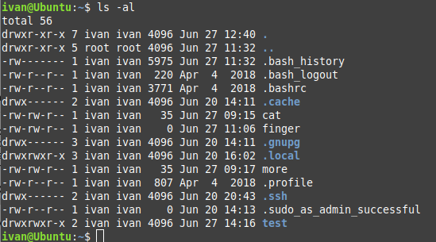

#### 12) What access rights exist and for whom (i. e., describe the main roles)? Briefly describe the acronym for access rights.

Categories of users

USER (OWNER)
GROUP
OTHERS

User group rights
r - read
w - write
x - execute

sticky bit - other x --> t
SUID       - user  x --> s
GUID       - group x --> s

#### 13) What is the sequence of defining the relationship between the file and the user?

Categories of users

USER (OWNER)
GROUP
OTHERS

User group rights
r - read
w - write
x - execute

sticky bit - other x --> t
SUID       - user  x --> s
GUID       - group x --> s

#### 14) What commands are used to change the owner of a file (directory), as well as the mode of access to the file? Give examples, demonstrate on the terminal.

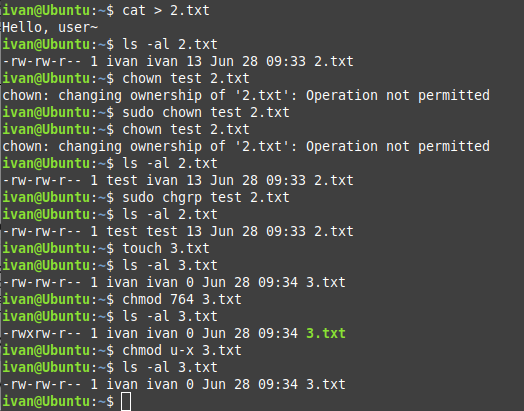

#### 15) What is an example of octal representation of access rights? Describe the umask command.

```
drwxr-xr-x 12 linuxize users 4.0K Apr  8 20:51 dirname
|[-][-][-]    [------] [---]
| |  |  |        |       |       
| |  |  |        |       +-----------> Group
| |  |  |        +-------------------> Owner
| |  |  +----------------------------> Others Permissions
| |  +-------------------------------> Group Permissions
| +----------------------------------> Owner Permissions
+------------------------------------> File Type
```

The first character represents the file type which can be a regular file (-), a directory (d), a symbolic link (l), or any other special type of file.

The next nine characters represent the permissions, three sets of three characters each. The first sets show the owner permissions, the second one group permissions, and the last set shows everybody else permissions.

Character r with an octal value of 4 stands for read, w with an octal value of 2 for write, x with an octal value of 1 for execute permission, and (-) with an octal value of 0 for no permissions.

There are also three other special file permissions types: setuid, setgid, and Sticky Bit.

In the example above (rwxr-xr-x) means that the owner has read, write and execute permissions (rwx), the group and others have read and execute permissions.

If we represent the file permissions using a numeric notation, we will come up to the number 755:

    Owner: rwx = 4+2+1 = 7
    Group: r-x = 4+0+1 = 5
    Other: r-x = 4+0+1 = 5

When represented in numeric notation, permissions can have three or four octal digits (0-7). The first digit represents the special permissions, and if it is omitted, it means that no special permissions are set on the file. In our example 755 is the same as 0755. The first digit can be a combination of 4 for setuid, 2 for setgid, and 1 for Sticky Bit.

File permissions can be changed using the chmod command and ownership using the chown command.

By default, on Linux systems, the default creation permissions are 666 for files, which gives read and write permission to user, group, and others, and to 777 for directories, which means read, write and execute permission to user, group, and others. Linux does not allow a file to be created with execute permissions.

The default creation permissions can be modified using the umask utility.

umask affects only the current shell environment. On most Linux distributions, the default system-wide umask value is set in the pam_umask.so or /etc/profile file.

If you want to specify a different value on a per-user basis, edit the user’s shell configuration files such as ~/.bashrc or ~/.zshrc. You can also change the current session umask value by running umask followed by the desired value.

To view the current mask value, simply type umask without any arguments:

`$ umask`

The umask value contains the permission bits that will NOT be set on the newly created files and directories.

You can also display the mask value in symbolic notation using the -S option:

`$ umask -S`

Unlike the numeric notation, the symbolic notation value contains the permission bits that will be set on the newly created files and directories.

The file creation mask can be set using octal or symbolic notation. To make the changes permanent, set the new umask value in a global configuration file like /etc/profile file which will affect all users or in a user’s shell configuration files such as ~/.profile, ~/.bashrc or ~/.zshrc, which will affect only the user. The user files have precedence over the global files.

#### 16) Give definitions of sticky bits and mechanism of identifier substitution. Give an example of files and directories with these attributes.

Special permissions make up a fourth access level in addition to user, group, and other. Special permissions allow for additional privileges over the standard permission sets (as the name suggests). There is a special permission option for each access level discussed previously. Let's take a look at each one individually, beginning with Set UID:

##### user + s (pecial)

Commonly noted as SUID, the special permission for the user access level has a single function: A file with SUID always executes as the user who owns the file, regardless of the user passing the command. If the file owner doesn't have execute permissions, then use an uppercase S here.

Now, to see this in a practical light, let's look at the /usr/bin/passwd command. This command, by default, has the SUID permission set:

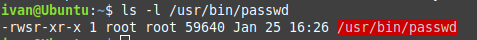

Note the s where x would usually indicate execute permissions for the user.

##### group + s (pecial)

Commonly noted as SGID, this special permission has a couple of functions:

    If set on a file, it allows the file to be executed as the group that owns the file (similar to SUID)

    If set on a directory, any files created in the directory will have their group ownership set to that of the directory owner

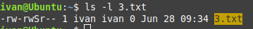

This permission set is noted by a lowercase s where the x would normally indicate execute privileges for the group. It is also especially useful for directories that are often used in collaborative efforts between members of a group. Any member of the group can access any new file. This applies to the execution of files, as well. SGID is very powerful when utilized properly.

As noted previously for SUID, if the owning group does not have execute permissions, then an uppercase S is used.

##### other + t (sticky)

The last special permission has been dubbed the "sticky bit." This permission does not affect individual files. However, at the directory level, it restricts file deletion. Only the owner (and root) of a file can remove the file within that directory. A common example of this is the /tmp directory:

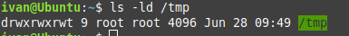

The permission set is noted by the lowercase t, where the x would normally indicate the execute privilege.

##### Setting special permissions

To set special permissions on a file or directory, you can utilize either of the two methods outlined for standard permissions above: Symbolic or numerical.

Let's assume that we want to set SGID on the file 3.txt.

To do this using the symbolic method, we do the following:

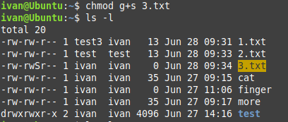

Using the numerical method, we need to pass a fourth, preceding digit in our chmod command. The digit used is calculated similarly to the standard permission digits:

    Start at 0
    SUID = 4
    SGID = 2
    Sticky = 1

The syntax is:

[tcarrigan@server ~]$ chmod X### file | directory

Where X is the special permissions digit.

Files with these attributes

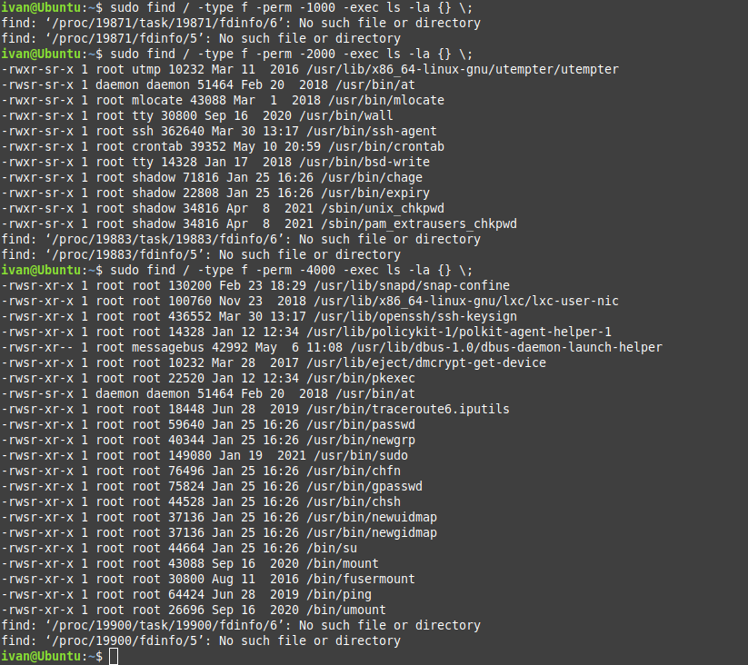

Directories

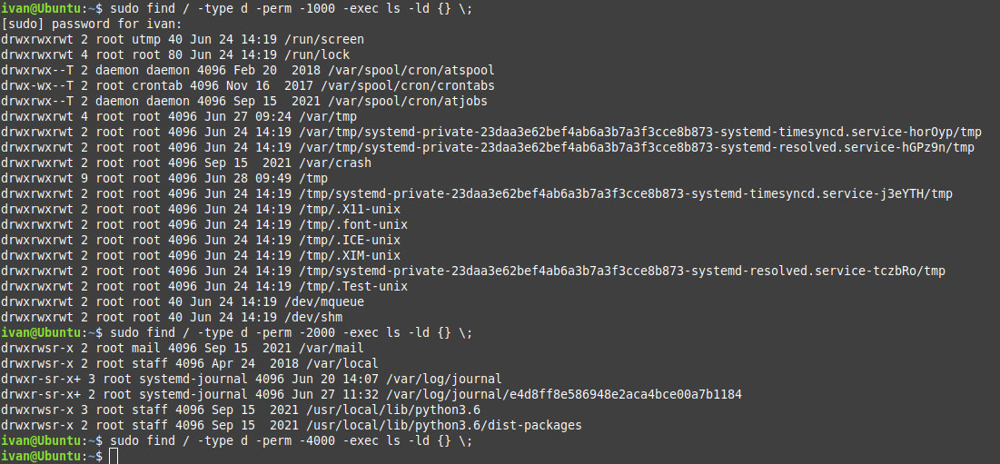


17) What file attributes should be present in the command script?

Execution bit


