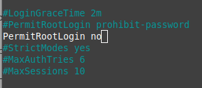
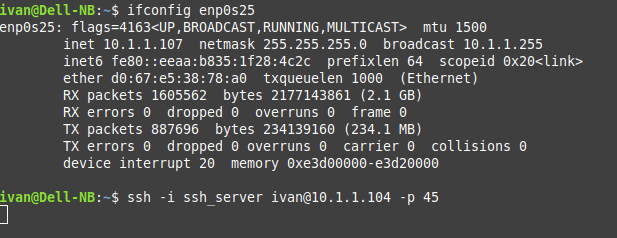

### Part1
#### 1. How many states could has a process in Linux?

5 States


#### 2. Examine the pstree command. Make output (highlight) the chain (ancestors) of the current process.


#### 3. What is a proc file system?

Proc file system (procfs) is virtual file system created on fly when system boots and is dissolved at time of system shut down.

It contains useful information about the processes that are currently running, it is regarded as control and information center for kernel.

The proc file system also provides communication medium between kernel space and user space.

In linux, /proc includes a directory for each running process, including kernel processes, in directories named /proc/PID, these are the directories present

```
directory	description
/proc/PID/cmdline - Command line arguments.
/proc/PID/cpu - 	Current and last cpu in which it was executed.
/proc/PID/cwd - Link to the current working directory.
/proc/PID/environ - Values of environment variables.
/proc/PID/exe - Link to the executable of this process.
/proc/PID/fd	 - Directory, which contains all file descriptors.
/proc/PID/maps - Memory maps to executables and library files.
/proc/PID/mem - Memory held by this process.
/proc/PID/root - Link to the root directory of this process.
/proc/PID/stat - Process status.
/proc/PID/statm - Process memory status information.
/proc/PID/status - Process status in human readable form.
```

Some other files in /proc file system are:

```
file	description
/proc/crypto - list of available cryptographic modules
/proc/diskstats -information (including device numbers) for each of the logical disk devices
/proc/filesystems - list of the file systems supported by the kernel at the time of listing
/proc/kmsg - holding messages output by the kernel
/proc/meminfo - summary of how the kernel is managing its memory.
/proc/scsi - information about any devices connected via a SCSI or RAID controller
/proc/tty - information about the current terminals
/proc/version - containing the Linux kernel version, distribution number, gcc version number (used to build the kernel) and any other pertinent information relating to the version of the kernel currently running
```

#### 4. Print information about the processor (its type, supported technologies, etc.).


#### 5. Use the ps command to get information about the process. The information should be as follows: the owner of the process, the arguments with which the process was launched for execution, the group owner of this process, etc.


#### 6. How to define kernel processes and user processes?

One way to recognize kernel processes is that they don't use any user memory, so the vsz field is 0. This also catches zombies, which can be eliminated based on their status.

So user processes may be found by command

`$ ps axl | awk '$7 != 0 && $10 !~ "Z"'`

Kernel processes

`$ ps axl | awk '!($7 != 0 && $10 !~ "Z")'`

#### 7. Print the list of processes to the terminal. Briefly describe the statuses of the processes. What condition are they in, or can they be arriving in?


Processes states (STAT column) that ps indicates are: 

```
D Uninterruptible sleep (usually IO)
R Running or runnable (on run queue)
S Interruptible sleep (waiting for an event to complete)
T Stopped, either by a job control signal or because it is being traced.
W paging (not valid since the 2.6.xx kernel)
X dead (should never be seen)
Z Defunct ("zombie") process, terminated but not reaped by its parent.
```

and the additional characters are:

```
< high-priority (not nice to other users)
N low-priority (nice to other users)
L has pages locked into memory (for real-time and custom IO)
s is a session leader
l is multi-threaded (using CLONE_THREAD, like NPTL pthreads do)
+ is in the foreground process group 
```

#### 8. Display only the processes of a specific user.


#### 9. What utilities can be used to analyze existing running tasks (by analyzing the help for the ps command)?

top, htop

#### 10. What information does top command display?

General Tasks, CPU, Memory info.

By processes: PID, user, cpu, memory info, time, command, ...

#### 11. Display the processes of the specific user using the top command.

`$ top -u ivan`


#### 12. What interactive commands can be used to control the top command? Give a couple of examples.

```
<Shift>+<N> — sort by PID;
<Shift>+<P> — sort by CPU usage;
<Shift>+<M> — sort by Memory usage;
<Shift>+<T> — sort by Time usage;
<Shift>+<Z> — change colors;
```

#### 13. Sort the contents of the processes window using various parameters (for example, the amount of processor time taken up, etc.)


#### 14. Concept of priority, what commands are used to set priority?

[INFO](https://www.tecmint.com/set-linux-process-priority-using-nice-and-renice-commands/)

There are a total of 140 priorities and two distinct priority ranges implemented in Linux. 

The first one is a nice value (niceness) which ranges from -20 (highest priority value) to 19 (lowest priority value) and the default is 0. 

The other is the real-time priority, which ranges from 1 to 99 by default, then 100 to 139 are meant for user-space.

`$ ps -u ivan -o pid,ppid,ni,comm`


`$ top -u ivan`


`$ htop`


From the top and htop outputs above, you’ll notice that there is a column called PR and PRI receptively which shows the priority of a process.

This, therefore, means that:

    NI – is the nice value, which is a user-space concept, while
    PR or PRI – is the process’s actual priority, as seen by the Linux kernel.

How To Calculate PR or PRI Values

```
Total number of priorities = 140
Real time priority range(PR or PRI):  0 to 99 
User space priority range: 100 to 139
```

Nice value range (NI): -20 to 19

```
PR = 20 + NI
PR = 20 + (-20 to + 19)
PR = 20 + -20  to 20 + 19
PR = 0 to 39 which is same as 100 to 139.
```

But if you see a rt rather than a number as shown in the screenshot below, it basically means the process is running under real-time scheduling priority.


**nice command**

The syntax is as follows:

```
$ nice -n niceness-value [command args] 
OR
$ nice -niceness-value [command args] 	#it’s confusing for negative values
OR
$ nice --adjustment=niceness-value [command args]
```

Important:

    - If no value is provided, nice sets a priority of 10 by default.
    - A command or program run without nice defaults to a priority of zero.
    - Only root can run a command or program with increased or high priority.
    - Normal users can only run a command or program with low priority.


#### 15. Can I change the priority of a process using the top command? If so, how?


Linux allows dynamic priority-based scheduling. Therefore, if a program is already running, you can change its priority with the **renice** command in this form:


Any changes you make with renice command to a user’s processes nice values are only applicable until the next reboot.

#### 16. Examine the kill command. How to send with the kill command process control signal? Give an example of commonly used signals.

To list the signal names, pass the -l option as follows:

`$ kill -l`


Mostly used signals are described below:

|Number|	Name (short name)|Description|Used for|
|---|---|---|:---|
|0 	|SIGNULL (NULL) |	Null 	|Check access to pid|
|1 	|SIGHUP (HUP) 	|Hangup 	|Terminate; can be trapped|
|2 	|SIGINT (INT) 	|Interrupt 	|Terminate; can be trapped|
|3 	|SIGQUIT (QUIT) 	|Quit 	|Terminate with core dump; can be trapped|
|9 	|SIGKILL (KILL) 	|Kill 	|Forced termination; cannot be trapped|
|15 	|SIGTERM (TERM) 	|Terminate 	|Terminate; can be trapped|
|19 	|SIGSTOP (STOP) 	|Stop 	|Pause the process; cannot be trapped. This is default if signal not provided to kill command.|
|20 	|SIGTSTP (STP) 	|Terminal 	|Stop/pause the process; can be trapped|
|18 	|SIGCONT (CONT) 	|Continue 	|Run a stopped process|


17. Commands jobs, fg, bg, nohup. What are they for? Use the sleep, yes command to demonstrate the process control mechanism with fg, bg.

**jobs** - list of jobs in shell

**fg** - move last job to foreground (make active)

**bg** - resumes suspended jobs in the background


**nohup** (No Hang Up) is a command in Linux systems that runs the process even after logging out from the shell/terminal.


### Part2
#### 1. Check the implementability of the most frequently used OPENSSH commands in the MS Windows operating system. (Description of the expected result of the commands +screenshots:  command – result should be presented)

powershell ssh


putty (portable; windows, linux, simple)


mobaxterm (portable; windows)


#### 2. Implement basic SSH settings to increase the security of the client-server connection (at least)

1.)Change defualt port 22 to another non-alike (45 for example)

`$ sudo nano /etc/ssh/sshd_config`


2.)Disable Server SSH Root Login




3.)Disable Password-Based Logins on Server

Install ssh keys on a remote machine

All command must be executed on local system/desktop/macos/freebsd workstation. Create the key pair:

`$ ssh-keygen -t rsa`


Install the public key in remote server:


Restrict access by password


Connect via ssh with previously generated key


4.) Restrict SSH Access Using iptables 
by ip, for example

test connection from 10.1.1.10


test connection from 10.1.1.107


allow connection to 10.1.1.104 only from 10.1.1.10

`$ sudo ufw allow from 10.1.1.10 to any port 45`


Test connection from 10.1.1.107 (connection is denied)



Test connection from 10.1.1.10 (connection is allowed)


#### 3. List the options for choosing keys for encryption in SSH. Implement 3 of them.

ssh options

     -p port
             Port to connect to on the remote host. This can be specified on a per-host basis in the configuration file.

     -i identity_file
             Selects a file from which the identity (private key) for public key authentication is read.

     -C      
             Requests compression of all data (including stdin, stdout, stderr, and data for forwarded X11, TCP and UNIX-domain connections).  The compression algorithm is the same used by gzip(1). Compression is desirable on modem lines and other slow connections, but will only slow down things on fast networks.


#### 4. Implement port forwarding for the SSH client from the host machine to the guest Linux virtual machine behind NAT.


5*. Intercept (capture) traffic (tcpdump, wireshark) while authorizing the remote client on the
server using ssh, telnet, rlogin. Analyze the result.