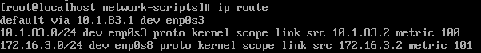

## Server1 configuration

Network plan


Created VMs in Virtualbox


Server1 VM


Client1 VM


Client2 VM


### 1. На Server_1 налаштувати статичні адреси на всіх інтерфейсах.

```
$ sudo nano /etc/netplan/00-config.yaml 
$ sudo netplan apply
```


Config file

```
#/etc/netplan/00-config.yaml 
# This is the network config written by 'subiquity'
network:
  ethernets:
    enp0s3:
      dhcp4: no
      addresses:
        - 10.1.1.10/24
      gateway4: 10.1.1.1
      nameservers:
          addresses: [10.1.1.1]
    enp0s8:
      dhcp4: no
      addresses:
        - 10.83.3.1/24
    enp0s9:
      dhcp4: no
      addresses:
        - 10.1.83.1/24
  version: 2

```

Also for testing purposes were configured interfaces on Client1 (Ubuntu)


and Client2 (CentOS 7)

```
# cd /etc/sysconfig/network-scripts
# vi ifcfg-enp0s3
...
# systemstl restart network
```


### 2. На Server_1 налаштувати DHCP сервіс, який буде конфігурувати адреси Int1 Client_1 та Client_2
```
sudo apt install isc-dhcp-server
```
Enable for interfaces enp0s8, enp0s9
```
#/etc/default/isc-dhcp-server
INTERFACESv4="enp0s8 enp0s9"
INTERFACESv6=""
```
Enter configuration
```
#/etc/dhcp/dhcpd.conf 
authoritative;
option domain-name-servers 10.1.1.1;

subnet 10.83.3.0 netmask 255.255.255.0 {
  range 10.83.3.2 10.83.3.100;
}

subnet 10.1.83.0 netmask 255.255.255.0 {
  range 10.1.83.2 10.1.83.100;
}
```
Restart server
```
$ sudo systemctl restart isc-dhcp-server.service
```


Change Client1 enp0s3 settings to dhcp


and Client2 enp0s3 settings to dhcp


### 3. За допомогою команд ping та traceroute перевірити зв'язок між віртуальними машинами. Результат пояснити.

Увага! Для того, щоб з Client_1 та Client_2 проходили пакети в мережу Internet
(точніше щоб повертались з Internet на Client_1 та Client_2) на Wi-Fi Router необхідно
налаштувати статичні маршрути для мереж Net2 та Net3

Ping works from Server1 to Host PC, Client1, Client2, Router and Internet Router.


Configure Internet Router Static routes


Routes for Client1


Routes for Client2


### 4. На віртуальному інтерфейсу lo Client_1 призначити дві ІР адреси за таким правилом: 172.17.D+10.1/24 та 172.17.D+20.1/24. Налаштувати маршрутизацію таким чином, щоб трафік з Client_2 до 172.17.D+10.1 проходив через Server_1, а до 172.17.D+20.1 через Net4. Для перевірки використати traceroute.


### Part1. Налаштувати маршрутизацію таким чином, щоб трафік з Client_2 до 172.17.13.1 проходив через Server_1

Add route on Server1
```
$ sudo ip route add 172.17.13.0/24 dev enp0s8
```


As Client2 uses 10.1.83.1 as default gateway - all ips not in routes will be redirected to 10.1.83.1 (Server1) that knows 172.17.13.0/24 network


### Part2. Трафік з Client_2 до 172.17.23.1 через Net4

As network 172.17.23.0/24 is not at routes on Server1 all outgoing traffic to mentioned network will be redirected through defaout gateway (10.1.1.1) to internet provider router ....


So we add new route to network 172.17.23.0/24 through enp0s8 interface (Net4)


Ping an traceroute to 172.17.23.1


### 5. Розрахувати спільну адресу та маску (summarizing) адрес 172.17.D+10.1 та 172.17.D+20.1, при чому маска має бути максимально можливою. Видалити маршрути, встановлені на попередньому кроці та замінити їх об’єднаним маршрутом, якій має проходити через Server_1.

Summarized address and mask for networks 172.17.13.0/24 and 172.17.23.0/24
```
172.17.0.0/19
```

Remove old routes from Server2 and Client2 for networks 172.17.13.0/24 and 172.17.23.0/24. Add new route to 172.17.0.0/19 through enp0s8 device




Ping and traceroute from Client2


### 6. Налаштувати SSH сервіс таким чином, щоб Client_1 та Client_2 могли підключатись до Server_1 та один до одного.

#### Client1 SSH connection to Server1 via all interfaces


#### Client1 SSH connection to Client2 


#### Client2 SSH connection to Server1 via all interfaces


#### Client2 SSH connection to Client2 


#### Server1 SSH connection to Client1


#### Server1 SSH connection to Client2


### 7. Налаштуйте на Server_1 firewall таким чином:
#### • Дозволено підключатись через SSH з Client_1 та заборонено з Client_2
Allow ssh connections from host network (bridge connection)
```sudo ufw allow from 10.1.1.0/24 to any port 22```


Allow ssh connections from Client1 to 10.83.3.1 only
```sudo ufw allow proto tcp from 10.83.3.2 to 10.83.3.1 port 22```


Other connections are denied. And from Client2 also.


ufw status


