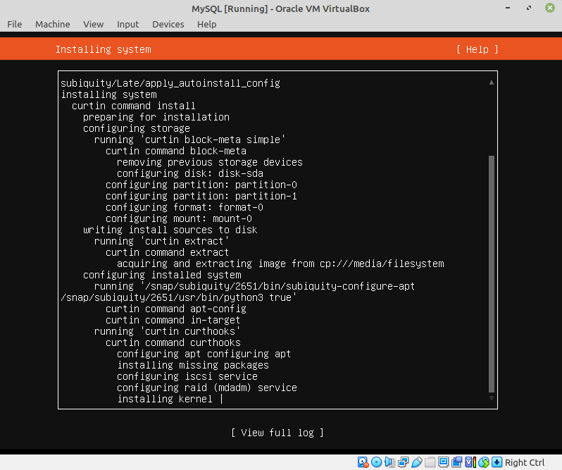
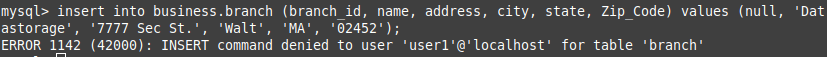

## EPAM University Programs
## DevOps external course
## Module 7 Database Administration

##TASK 7.1
###PART 1

#### 1.Download MySQL server for your OS on VM.

#### 2.Install MySQL server on VM.


[Add new user](https://www.digitalocean.com/community/tutorials/mysql-ru)

```
CREATE USER 'newuser'@'localhost' IDENTIFIED BY 'password';
GRANT ALL PRIVILEGES ON *.* TO 'USERNAME'@'%' IDENTIFIED BY 'PASSWORD' WITH GRANT OPTION;
FLUSH PRIVILEGES;

mysql -u [username] -p
```

#### 3.Select a subject area and describe the database schema, (minimum 3 tables)

[Database Schema](create_db_schema.sql) 

[Original database schema](https://o7planning.org/10235/sample-mysql-database-for-learning-sql#a23366)


#### 4.Create a database on the server through the console.


#### 5. Fill in tables.

[Database Fill Script](fill_db.sql)


#### 6.Construct and execute SELECT operator with WHERE, GROUP BY and ORDER BY.
```
SELECT 
    acc.product_cd,
    COUNT(acc.product_cd) AS Count_Acc,
    SUM(acc.avail_balance) AS Sum_Avail_Balance,
    AVG(acc.avail_balance) AS Avg_Avail_Balance
FROM
    account acc
GROUP BY acc.product_cd
HAVING COUNT(acc.product_cd) > 3
ORDER BY Sum_Avail_Balance;
```


#### 7.Execute other different SQL queries DDL, DML, DCL.


##### DDL - Data Definition Language.

```
create table PC_Users (
        user_id integer not null auto_increment,
        avail_balance float,
        status varchar(10),
        primary key (user_id)
);
```


```
alter table PC_Users 
    add min_balance float;
describe PC_Users;
```


```
drop table PC_Users;
```


##### DML - Data Manipulation Language.

```
insert into branch (branch_id, name, address, city, state, Zip_Code) values (null, 'Datastorage', '7777 Sec St.', 'Walt', 'MA', '02452');
```


```
update branch 
set 
    Zip_Code = '111111'
where
    name = 'Datastorage';
```


```
delete from branch 
where
    name = 'Datastorage';
```


#### 8.Create a database of new users with different privileges. Connect to the
database as a new user and verify that the privileges allow or deny certain
actions.

##### DCL - Data Control Language.

Create new user and update its password.

```
create user 'user1'@'localhost';
update mysql.user set authentication_string = password('NEW_USER_PASSWORD') where user = 'user1' and host = 'localhost';
flush privileges;
```


```
grant select on business.* to 'user1'@'localhost';
```




```
grant select,insert on business.* to 'user1'@'localhost';
```


```
revoke insert on business.* from 'user1'@'localhost';
```


```
revoke all on business.* from 'user1'@'localhost';
```


#### 9.Make a selection from the main table DB MySQL.

```
SELECT 
    acc.product_cd,
    COUNT(acc.product_cd) AS Count_Acc,
    SUM(acc.avail_balance) AS Sum_Avail_Balance,
    AVG(acc.avail_balance) AS Avg_Avail_Balance
FROM
    account acc
GROUP BY acc.product_cd
HAVING COUNT(acc.product_cd) > 3
ORDER BY Sum_Avail_Balance;
```


### PART 2
#### 10.Make backup of your database.
```
mysqldump -u ivan -p business > business.sql
```


[Created dump file](business.sql)

#### 11.Delete the table and/or part of the data in the table.


#### 12.Restore your database.

```
mysql -u ivan -p business < business.sql
```


#### 13.Transfer your local database to RDS AWS.


#### 14.Connect to your database.


#### 15.Execute SELECT operator similar step 6.


#### 16.Create the dump of your database.


[Created dump files](./Dump20220615)

### PART 3 – MongoDB

[Install on Ubuntu 18.04](https://www.digitalocean.com/community/tutorials/how-to-install-mongodb-on-ubuntu-18-04-ru)

```
$ sudo apt-get install -y mongodb
$ sudo systemctl status mongodb
```


`$ mongo --eval 'db.runCommand({ connectionStatus: 1 })'`


#### 17. Create a database. Use the use command to connect to a new database (If it doesn't exist, Mongo will create it when you write to it).


#### 18. Create a collection. Use db.createCollection to create a collection. I'll leave the
subject up to you. Run show dbs and show collections to view your database andcollections.


#### 19. Create some documents. Insert a couple of documents into your collection. I'll
leave the subject matter up to you, perhaps cars or hats.


#### 20. Use find() to list documents out.

