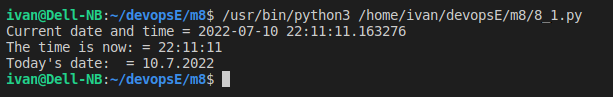
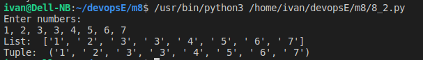
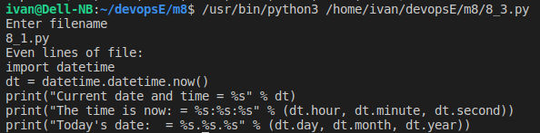
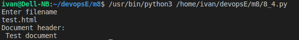
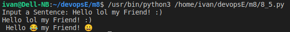
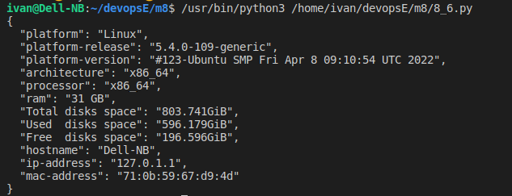

## Python tasks

### 1) Write easy program, which will display current date and time.

[Program source code](8_1.py)

```
import datetime

dt = datetime.datetime.now()

print("Current date and time = %s" % dt)

print("The time is now: = %s:%s:%s" % (dt.hour, dt.minute, dt.second))

print("Today's date:  = %s.%s.%s" % (dt.day, dt.month, dt.year))
```

**Results:**



### 2) Write python program, which will accept comma-separated numbers, and then it should write tuple and list of them:

```
Enter numbers: 1, 2, 7, 43, 9
Output:
List: [‘1’, ‘2’, ‘7’, ‘43’, ‘9’]
Tuple: (‘1’, ‘2’, ‘7’, ‘43’, ‘9’)
```

[Program source code](8_2.py)

```
print("Enter numbers:")

lst = input().split(',')

print("List: ", lst)

print("Tuple: ", tuple(lst))

```

**Results:**



### 3) Write python program, which will ask file name. File should be read, and only even lines should be shown.

[Program source code](8_3.py)

```
print("Enter filename")
filename = input()
# filename=8_1.py
try:
    file = open(filename)
except:
    print("Can't open file!")
else:
    print("Even lines of file:")
    i = 1
    for line in file:
        if i % 2 != 0:
            print(line.rstrip())
        i = i + 1

```

**Results:**



### 4) Write python program, which should read html document, parse it, and show it’s title.

[Program source code](8_4.py)

```
from bs4 import BeautifulSoup
print("Enter filename")
filename = input()
# filename="test.html"
try:
    file = open(filename)
except:
    print("Can't open file!")
else:
    data = BeautifulSoup(file, "html.parser")
    print("Document header:\n", data.head.title.text)
```

[File test.html](test.html)

```
<!DOCTYPE html>
<html lang="en">

<head>
    <meta charset="UTF-8">
    <meta http-equiv="X-UA-Compatible" content="IE=edge">
    <meta name="viewport" content="width=device-width, initial-scale=1.0">
    <title>Test document</title>
</head>

<body>

</body>

</html>
```

**Results:**



### 5) Write python program, which will parse user’s text, and replace some emotions with emoji’s (Look: pip install emoji)

[Program source code](8_5.py)

```
def main():
    sentence = input("Input a Sentence: ")
    print(sentence)
    sentence = convert(sentence)
    print(sentence)


def convert(sentence):
    words = sentence.split(" ")
    emojis = {
        ":)": "😀",
        ":(": "😞",
        "lol": "😂",
        "sick": "😨",
        "happy": "😀"
    }
    outcome = " "
    for word in words:
        outcome += emojis.get(word, word) + " "
    return outcome


main()
```

**Results:**



### 6) Write program, that will show basic PC information (OS, RAM amount, HDD’s, and etc.)

[Program source code](8_6.py)

```
import platform
import socket
import re
import uuid
import json
import psutil
import logging


def getSystemInfo():
    try:
        info = {}
        info['platform'] = platform.system()
        info['platform-release'] = platform.release()
        info['platform-version'] = platform.version()
        info['architecture'] = platform.machine()
        info['processor'] = platform.processor()
        info['ram'] = str(
            round(psutil.virtual_memory().total / (1024.0 ** 3)))+" GB"
        total = int()
        used = int()
        free = int()
        for disk in psutil.disk_partitions():
            if disk.fstype:
                total += int(psutil.disk_usage(disk.mountpoint).total)
                used += int(psutil.disk_usage(disk.mountpoint).used)
                free += int(psutil.disk_usage(disk.mountpoint).free)
        info['Total disks space'] = str(
            round(total / (1024.0 ** 3), 3)) + "GiB"
        info['Used  disks space'] = str(round(used / (1024.0 ** 3), 3)) + 'GiB'
        info['Free  disks space'] = str(round(free / (1024.0 ** 3), 3)) + 'GiB'
        info['hostname'] = socket.gethostname()
        info['ip-address'] = socket.gethostbyname(socket.gethostname())
        info['mac-address'] = ':'.join(re.findall('..',
                                       '%012x' % uuid.getnode()))
        return json.dumps(info)
    except Exception as e:
        logging.exception(e)


json_object = json.loads(getSystemInfo())

json_formatted_str = json.dumps(json_object, indent=2)

print(json_formatted_str)
```

**Results:**


