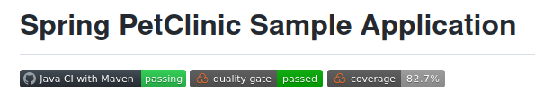

# PetClinic Project AWS Deployment

The project [**spring-framework-petclinic**](https://github.com/spring-petclinic/spring-framework-petclinic) was selected as sample project for AWS Deployment.

[My forked version of project](https://github.com/uixcoder/spring-framework-petclinic) has some small changes (related to default database selection) in **pom.xml** file as i done 2 variants of deployment.

Stages:

1. **Manual deployment on Virtualbox VM (Ubuntu 18.04)**
    
    -- Gathering info about needed software  
         
         Well works on soft:
         - Git 3.8.6
         - Open JDK 11
         - Maven 
         - Tomcat 9.0.64

    -- 
